# 焼津市スマートシティ MCPサーバー E2Eシステムフロー

## シーケンス図

```mermaid
sequenceDiagram
    participant User as ユーザー/Claude
    participant MCP as MCPサーバー<br/>(FastMCP)
    participant DocManager as APIドキュメント<br/>マネージャー
    participant Scraper as 焼津API<br/>スクレイパー
    participant APIClient as HTTP<br/>クライアント<br/>(aiohttp)
    participant YaizuCatalog as 焼津市APIカタログ<br/>(city-api-catalog)
    participant YaizuAPI as 焼津市スマートシティAPI<br/>(NGSIv2)

    Note over User,YaizuAPI: 初期化フェーズ
    User->>MCP: MCPサーバー起動
    MCP->>DocManager: APIDocumentManager初期化
    DocManager->>DocManager: data/api_specs<br/>ディレクトリ確認・作成
    DocManager-->>MCP: マネージャー準備完了
    MCP->>MCP: FastMCPツール登録<br/>(@mcp.tool, @mcp.resource)
    MCP-->>User: サーバー起動完了

    Note over User,YaizuAPI: APIドキュメントスクレイピングフェーズ
    User->>MCP: scrape_api_docs()呼び出し
    MCP->>DocManager: initialize_scraper()
    DocManager->>Scraper: YaizuAPIScraper初期化
    Scraper->>Scraper: .envファイル読み込み<br/>(YAIZU_USERNAME, YAIZU_PASSWORD)
    Scraper-->>DocManager: スクレイパー準備完了

    Note over Scraper,YaizuCatalog: カタログサイト認証
    Scraper->>YaizuCatalog: POST /auth/login<br/>Basic Authentication
    YaizuCatalog-->>Scraper: セッションCookie返却
    Scraper->>Scraper: セッション保存

    Note over Scraper,YaizuCatalog: APIカタログスクレイピング
    Scraper->>YaizuCatalog: GET /yaizu
    YaizuCatalog-->>Scraper: HTMLページ返却
    Scraper->>Scraper: BeautifulSoupで解析<br/>APIリンク抽出
    
    loop 各APIエンドポイントごと
        Scraper->>YaizuCatalog: GET /yaizu/apis/{api_id}
        YaizuCatalog-->>Scraper: API詳細ページ
        Scraper->>Scraper: データモデル抽出<br/>属性情報パース
    end

    Scraper->>Scraper: 防災関連API分類<br/>(災害、避難所、警報等)
    Scraper->>DocManager: スクレイピング結果返却
    DocManager->>DocManager: JSONファイル保存<br/>(api_catalog.json, disaster_apis.json等)
    DocManager-->>MCP: スクレイピング完了
    MCP-->>User: スクレイピング結果サマリー

    Note over User,YaizuAPI: API検索・詳細取得フロー
    User->>MCP: search_api_docs("防災")
    MCP->>DocManager: search_apis("防災")
    DocManager->>DocManager: 全JSONファイル読み込み<br/>キーワード検索
    DocManager-->>MCP: 検索結果リスト
    MCP-->>User: 防災関連API一覧

    User->>MCP: get_api_details("EvacuationShelter")
    MCP->>DocManager: load_api_docs("EvacuationShelter")
    DocManager->>DocManager: JSONファイル読み込み
    DocManager-->>MCP: API詳細情報
    MCP->>MCP: レスポンス整形<br/>(属性、エンドポイント、例)
    MCP-->>User: 避難所API詳細

    Note over User,YaizuAPI: 焼津市API実行フロー（NGSIv2）
    User->>MCP: execute_yaizu_api("Aed", limit=10)
    MCP->>MCP: .envからAPIキー取得<br/>(YAIZU_API_KEY)
    MCP->>MCP: サービスパス決定<br/>(/Aed)
    MCP->>APIClient: aiohttp ClientSession作成
    APIClient->>YaizuAPI: GET /v2/entities?type=Aed&limit=10<br/>Headers: apikey, Fiware-Service, Fiware-ServicePath
    YaizuAPI-->>APIClient: NGSIv2 JSONレスポンス<br/>(エンティティ配列)
    APIClient-->>MCP: APIレスポンス
    MCP->>MCP: データサマリー作成<br/>(名称、住所、位置情報抽出)
    MCP-->>User: AEDデータ+統計情報

    Note over User,YaizuAPI: コマンド生成支援フロー
    User->>MCP: generate_api_command("DisasterMail")
    MCP->>DocManager: load_api_docs("DisasterMail")
    DocManager-->>MCP: DisasterMail仕様
    MCP->>MCP: コマンド例生成<br/>(基本、地理検索、フィルタ等)
    MCP-->>User: 実行可能コマンド例集

    Note over User,YaizuAPI: エラーハンドリングフロー
    User->>MCP: execute_yaizu_api("InvalidType")
    MCP->>APIClient: API呼び出し
    APIClient->>YaizuAPI: GET /v2/entities?type=InvalidType
    YaizuAPI-->>APIClient: 404 Not Found
    APIClient-->>MCP: エラーレスポンス
    MCP-->>User: エラー詳細+対処法

    Note over User,YaizuAPI: レート制限対応
    User->>MCP: 連続API呼び出し
    MCP->>APIClient: API呼び出し
    APIClient->>YaizuAPI: 複数リクエスト
    YaizuAPI-->>APIClient: 429 Too Many Requests<br/>x-ratelimit-remaining-minute: 0
    APIClient-->>MCP: レート制限エラー
    MCP-->>User: レート制限通知<br/>待機推奨

    Note over User,YaizuAPI: リソースアクセスフロー（MCP Resource）
    User->>MCP: yaizu://disaster-apis リソース要求
    MCP->>DocManager: load_api_docs("disaster_apis")
    DocManager-->>MCP: 防災APIデータ
    MCP->>MCP: リソース形式で整形
    MCP-->>User: 防災API一覧リソース

    Note over User,YaizuAPI: プロンプト実行フロー
    User->>MCP: analyze_disaster_apis プロンプト実行
    MCP-->>User: 防災API分析手順提供
    User->>MCP: 手順に従ってツール実行
    MCP->>DocManager: 各種API情報取得
    DocManager-->>MCP: データ返却
    MCP-->>User: 分析結果
```

## 説明

このシーケンス図は、焼津市スマートシティMCPサーバーの実際のE2Eシステムフローを示しています：

### 主要コンポーネント

1. **ユーザー/Claude**: MCPクライアント（Claude Desktop/Code）
2. **MCPサーバー**: FastMCPベースのサーバー実装
3. **APIドキュメントマネージャー**: ローカルJSON管理
4. **焼津APIスクレイパー**: APIカタログサイトのスクレイピング
5. **HTTPクライアント**: aiohttp による API通信
6. **焼津市APIカタログ**: ドキュメントサイト (city-api-catalog.smartcity-pf.com)
7. **焼津市スマートシティAPI**: FIWARE NGSIv2 API

### 主要フロー

#### 1. 初期化フェーズ
- FastMCPサーバーが起動し、APIドキュメントマネージャーを初期化
- data/api_specsディレクトリの確認と作成
- ツールとリソースの登録

#### 2. スクレイピングフェーズ
- Basic認証でAPIカタログサイトにログイン
- BeautifulSoupでHTML解析し、API情報を抽出
- データモデル、属性、エンドポイント情報の収集
- 防災関連APIの自動分類
- JSONファイルとしてローカル保存

#### 3. API検索・詳細取得
- ローカルJSONファイルからキーワード検索
- API詳細情報の整形と表示
- データモデル、属性、サンプルの提供

#### 4. 焼津市API実行（NGSIv2）
- .envファイルからAPIキー取得
- FIWARE NGSIv2仕様に従ったヘッダー設定
  - `apikey`: 認証用APIキー
  - `Fiware-Service`: smartcity_yaizu
  - `Fiware-ServicePath`: エンティティ別パス
  - `x-request-trace-id`: UUID形式のトレースID
- エンティティデータの取得と整形
- 名称、住所、位置情報の抽出とサマリー作成

#### 5. コマンド生成支援
- エンティティタイプに応じたコマンド例の自動生成
- NGSIv2クエリパラメータの説明
- 地理検索、フィルタリング、ソートの例示

#### 6. エラーハンドリング
- 401: 認証エラー（APIキー無効）
- 403: アクセス拒否（権限不足）
- 404: エンティティタイプ不明
- 429: レート制限（x-ratelimit-remaining-minute）

#### 7. MCPリソース提供
- `yaizu://api-docs`: APIカタログ全体
- `yaizu://disaster-apis`: 防災関連API
- `yaizu://info`: 焼津市基本情報
- `yaizu://status`: サーバーステータス

### データフロー

1. **スクレイピング → ローカル保存**
   - APIカタログサイトからデータ取得
   - JSONファイルとしてdata/api_specsに保存

2. **ローカルデータ → ユーザー提供**
   - 保存済みJSONから高速検索
   - オフライン環境でも利用可能

3. **API実行 → リアルタイムデータ**
   - NGSIv2 APIから最新データ取得
   - レート制限の考慮

### セキュリティ

- Basic認証（スクレイピング）: .envファイルで管理
- APIキー認証（NGSIv2）: .envファイルで管理
- レート制限対応: ヘッダーで残り回数確認

### 実装ファイル
- `/Users/mamo/smartcity-mcp/mcp/server.py` - MCPサーバー実装
- `/Users/mamo/smartcity-mcp/mcp/scraper.py` - スクレイピング実装
- `/Users/mamo/smartcity-mcp/data/api_specs/` - JSONデータ保存先